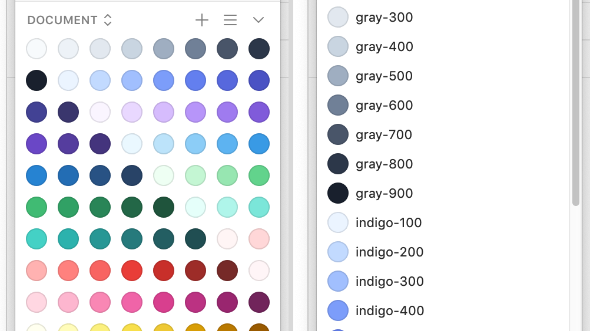

# TailwindCSS color palette for Sketch Palettes plugin

You can load all colors at once from [all.sketchpalette][all-palettes] or separately (`.sketchpalette` format is used in the [Sketch Palettes][plugin] plugin).

## Installation

* Download [all.sketchpalette][all-palettes]
* Install [Sketch Palettes][plugin] plugin
* Follow the plugin [instructions][plugin]

[plugin]: https://github.com/andrewfiorillo/sketch-palettes
[all-palettes]: https://github.com/ivanvotti/tailwind-palettes/releases/download/0.1/all.sketchpalette